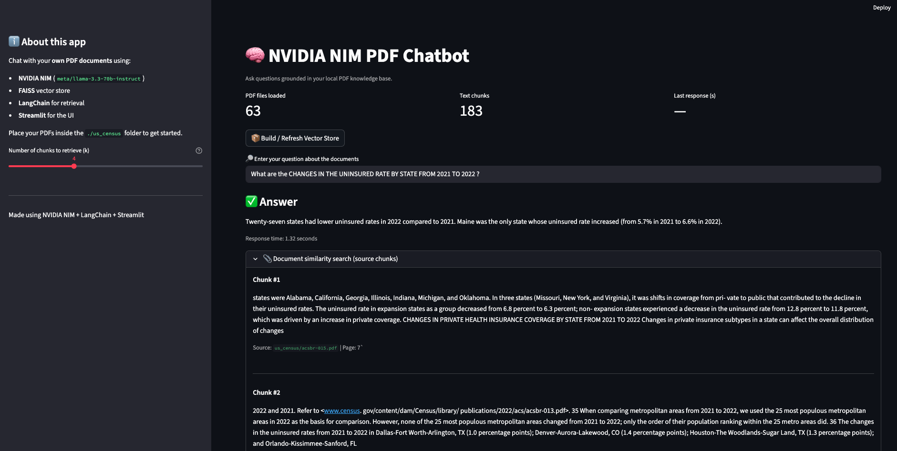
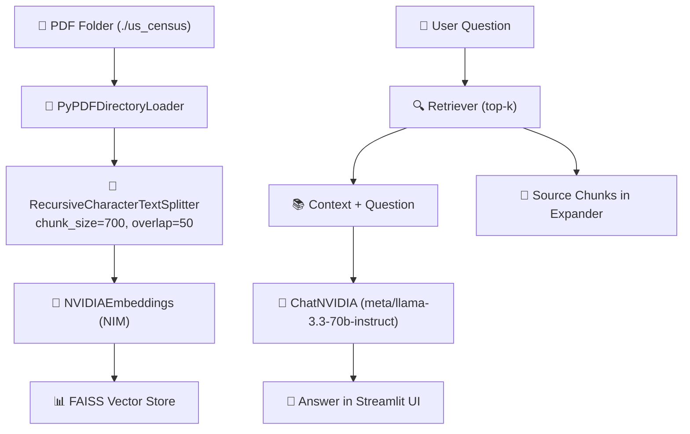

# 🧠 NVIDIA NIM PDF Chatbot

Chat with your **own PDF documents** using **NVIDIA NIM**, **LangChain**, **FAISS**, and **Streamlit**.

This app builds a local vector store over your PDFs and uses the
`meta/llama-3.3-70b-instruct` model served via **NVIDIA Inference Microservices (NIM)**
to answer questions grounded strictly in your documents.

> **Tech focus:** Retrieval-Augmented Generation (RAG) with NVIDIA NIM.

---

## 🚀 Demo




---

## ✨ Features

- 🔗 RAG over local PDFs using FAISS and NVIDIAEmbeddings
- 🧠 NVIDIA NIM LLM (meta/llama-3.3-70b-instruct) for high-quality answers
- 🧩 Chunking & retrieval with RecursiveCharacterTextSplitter and LangChain retriever
- 📎 Source transparency – view the exact chunks used to answer each question
- ⚙️ Configurable retrieval (top-k slider for number of chunks)
- 📊 Live metrics – number of PDFs, chunks, and last response time
- 🖥️ Clean Streamlit UI ready for local or cloud deployment

  ---

## 🧱 Architecture


---

## 🧰 Tech Stack

- Frontend / App: Streamlit
- Model Serving: NVIDIA NIM (meta/llama-3.3-70b-instruct)
- RAG Framework: LangChain (community + core + text splitters)
- Vector Store: FAISS (CPU)
- Document Loader: PyPDFDirectoryLoader
- Config: python-dotenv for managing NVIDIA_API_KEY


---

## 📂 Project Structure
```bash
NVIDIA-NIM-PDF-Chatbot/
├─ us_census/               # Sample PDFs (add your documents here)
├─ finalapp.py              # Main Streamlit application
├─ requirements.txt         # Python dependencies
├─ .env.example             # Template for NVIDIA API key
└─ README.md
```

---

## ⚙️ Setup & Installation

### 1️⃣ Clone the repository
```
git clone https://github.com/<your-username>/NVIDIA-NIM-PDF-Chatbot.git
cd NVIDIA-NIM-PDF-Chatbot
```

### 2️⃣ Create and activate a virtual environment (optional but recommended)
```
python -m venv venv
source venv/bin/activate      # macOS / Linux
# venv\Scripts\activate       # Windows
```

### 3️⃣ Install dependencies
```
pip install -r requirements.txt
```

### 4️⃣ Configure NVIDIA NIM API key

Create a .env file in the project root:
```
NVIDIA_API_KEY=your_nim_api_key_here
```

You can get this key from the NVIDIA NIM / AI Foundation Models console.


  
